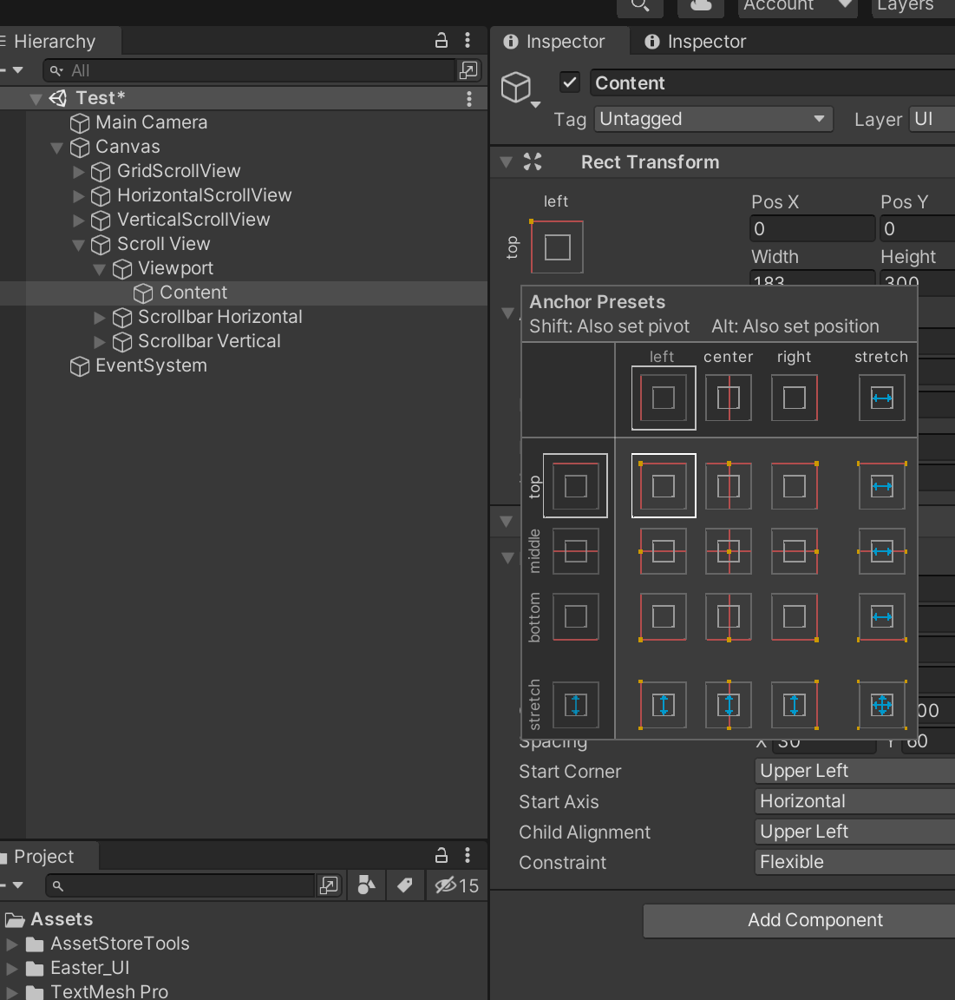
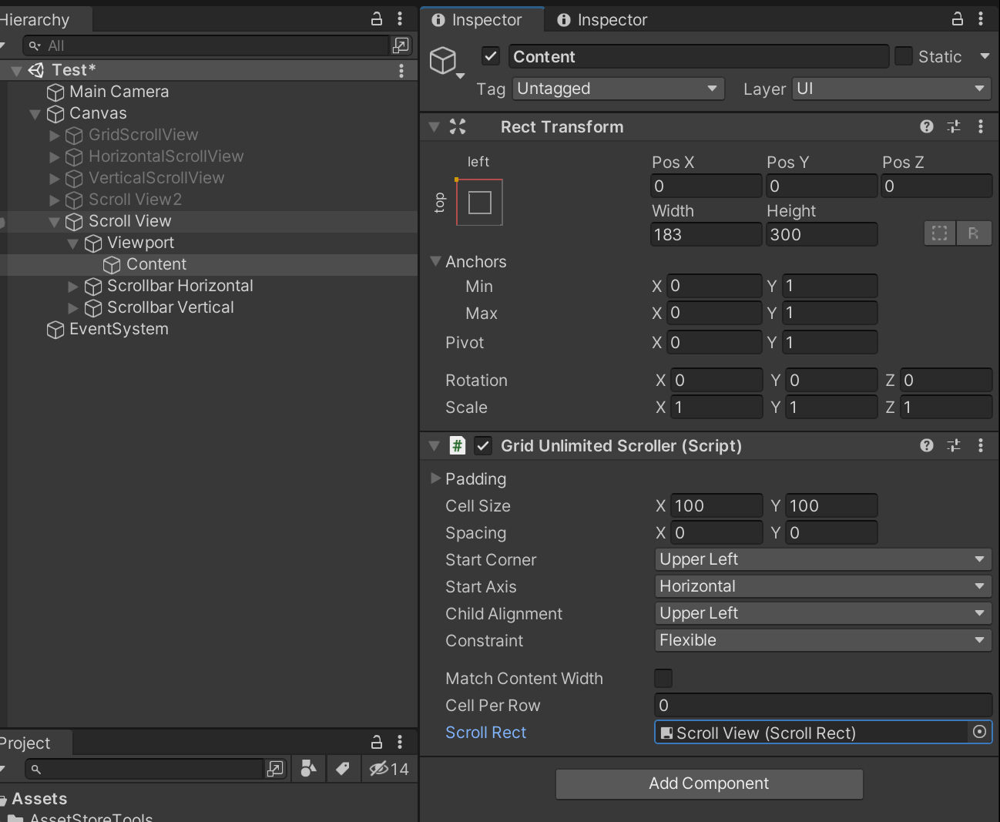

# Unlimited Scroll UI
#### version 1.0.0

## Quick Setup
**Step 1:** Add “UI/Scroll View” from Add GameObject menu.  

**Step 2:** Change the anchor of the “Content” object to upper left.  

**Step 3:** Add UnlimitedScroller with your desired auto layout type.  

**Step 4:** Drag and drop the scroll view to `Scroll Rect` field.  

**Step 5:** Prepare a cell prefab that has the `RegularCell` script or your custom script that implements the `ICell` interface.  

**Step 6:** To test it out immediately, add a `ScrollerTest` script below `Unlimited Scroller`, reference to your cell and set total count.

## References
Please go to this website for full reference: https://brian-jiang.github.io/UnlimitedScrollUI/api/UnlimitedScrollUI.html
### UnlimitedScroller  class
#### Fields
**Cell Per Row**: How many cells you want in a row. Only has effect if you uncheck “Match Content Width” and use Grid Layout Group.  
**Match Content Width**: Set Cell Per Row to fill the width of content. Only has effect if you use Grid Layout Group.  
**Content Trans**: RectTransform of your content.  
**Layout Group**: Layout Group on your content.  
**Layout Type**: Type of your layout group.

### RegularCell  class
#### Fields
**Animation Type**: Type of animation you want to use when the cell becomes visible.  
**Animation Interval**: Length of the animation.  
**Fade From**: Animate transparency from this value to 1 if you choose to fade.  
**Scale From**: Scale from this value to 1 if you choose to scale.  
**On Generated**: You can add your own listeners to this event to be called when the cell becomes visible.

### ICell interface
#### Methods
**On Generated**: Called when the cell is generated.

## Supports
If you have any questions, please comment [here](http://u3d.as/2z2a)  
Or email me directly at: bjjx1999@live.com  
Thank you for your support!
