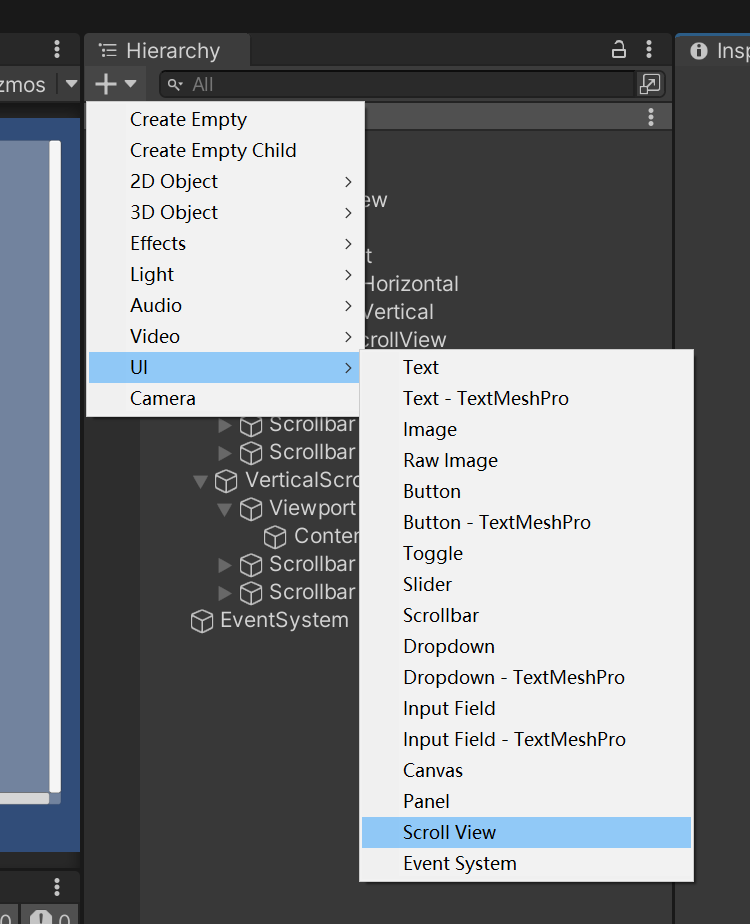

# Unlimited Scroll UI
#### version 1.5.0

## Summary
A plugin in Unity that let you easily create scroll views with unlimited items. See in [asset store](http://u3d.as/2z2a).

## Quick Setup
**Step 1:** Add “UI/Scroll View” from Add GameObject menu.  

**Step 2:** Add UnlimitedScroller with your desired auto layout type.  

**Step 3:** Drag and drop the scroll view to `Scroll Rect` field. Set initial cell cache count.  
If you use grid scroller, you can also change its alignment.  

**Step 4:** Prepare a cell prefab that has the `RegularCell` script or your custom script that implements the `ICell` interface.  

**Step 5:** To test it out immediately, add a `ScrollerTest` script below `Unlimited Scroller`, reference to your cell and set total count.

## References
Please go to this website for full reference: https://brian-jiang.github.io/UnlimitedScrollUI/api/UnlimitedScrollUI.html

## Supports
If you have any questions, please post [here](https://github.com/Brian-Jiang/UnlimitedScrollUI)
or comment [here](http://u3d.as/2z2a)  
Or email me directly at: [bjjx1999@live.com](mailto:bjjx1999@live.com)  
Thank you for your support!
